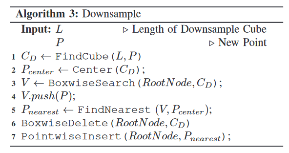

# **ikd-tree**

Ikdtree算法来自由港大MaRS实验室发表的[fast-lio2](https://arxiv.org/abs/2107.06829)。其中i是incremental的缩写，表示增量的kdtree，能够动态地插入或删除点。

源码：https://github.com/hku-mars/FAST_LIO

## 提出背景

​		静态的kd-tree结构面对大量数据增删的情况下会变得不平衡，大大降低了搜索效率。如果为了解决静态 kd-tree 的不均衡问题而频繁重新构建 kdtree 的话，造成的时间花销对实时性要求高的算法不能接受的。

​		如果能构建一个增量式的动态 kd-tree 结构，支持增量式的插入和删除，支持自行调整 tree 的结构、始终保持动态平衡，一切的问题就会迎刃而解。

​		对于静态kd-tree的删除是一个很低效的操作，删除一个中间节点意味着该节点下方的所有节点都要重新构建subtree。因此，所有的增量式kd-tree结构，基本都会采用lazy delete策略：也就是删除一个节点时，先将其标记为删除，被标记为删除的节点在 kNN 搜索时会被跳过，但在树形结构中它还是存在的。只有当tree结构被彻底重构时（低频），才会借机真的把这些节点从tree结构中拿掉。这样的lazy delete策略在早期的动态kd-tree结构中已经被应用了，比如2014年开源的[nanoflann](https://github.com/jlblancoc/nanoflann)。而ikd-Tree沿用了这一策略。

## ikd-tree 实现功能

1. 支持local map随着pose移动 → 支持高效地动态增删；


2. 支持始终如一的高效 kNN&ranged-kNN搜索 → 能够始终保持tree的平衡，做到动态re-balance


3. 点的数量不要太大，点无需太过稠密 → 自带体素降采样功能（原始点云融合）；

## ikd-tree 节点数据结构

​		ikd-Tree论文中描述的节点数据结构如下左图所示，但实际代码（右图）中多了很多与节点自身状态和 subtree统计信息有关的变量。从理解ikd-Tree的需求来看，我们无需搞懂代码中的每一项都是什么含义，只需要理解论文中给出的数据结构的含义就好了。

其中，*treesize/invalidnum/deleted/treedeleted* 四个成员都和上文提到的lazy delete策略有关。

​		*range* 指的是以当前节点为根节点的subtree中的所有节点，它们在三维空间中的最小包络盒。从代码中可以看出，range 包含了两组`{x,y,z}`坐标，正好是最小包络盒的 min point 和 max point。**注意：range 仅包括 subtree 中没有被删除的点**，那些被标记为删除的点不在统计范围内（删除和增加的时候如何修改range？）。range 信息非常的重要，在搜索和删除操作中，剪枝加速都是基于这个信息实现的。


## ikd-tree 的搜索

​		ikd-Tree 中的 kNN & ranged-kNN 搜索基本与常规 kd-tree 相同。ikd-Tree 中充分利用了数据结构部分提到的 **range信息** 来进行剪枝加速，也即在每个节点处，除了计算节点本身与查询点的距离之外，也会分别判断左右两个子树的range 是否与目标解空间有重叠，只有有重叠的子树才会被继续递归搜索，没重叠的子树将直接被剪枝掉，实现搜索加速。（可以发现，这个搜索过程本身已经包含了常规kdtree 的 bounds-overlap-ball 条件）

## ikd-tree 的平衡性判据

​		实现动态再平衡的前提条件是，首先要知道哪些 (sub)tree 是不平衡的。因此，ikd-Tree 提出了一个准则来随时判断任何一个 (sub)tree 平衡与否。这个准则包含两个小准则，如下。


其中， *α-balanced* 准则描述的是我们最大能够容忍一个subtree的左右两侧有多不平衡，否则就会被执行重构； *α-deleted* 描述的是我们最多能够容忍一个subtree中有多大比例“被标记为删除、但是还没有事实删除的点“，否则就会被执行重构。

当且仅当两项准则都符合时，才会认为一个 (sub)tree 是平衡的。

##  ikd-Tree的再平衡算法（主线程）

​		当ikd-Tree通过平衡性判据发现某一个(sub)tree不平衡时，就会触发对该(sub)tree的重建，以实现再平衡。这里又分为两种情况，如果该(sub)tree规模很小，重建时间花销可以忽略，就在主线程中直接重建，重建过程如下图所示。


​		重建时先把(sub)tree的所有节点打乱重排，在这一过程中会拿掉标记删除的点（Flatten）；然后，对剩下的点按中值点法执行常规的kdtree构建过程（Build）；构建完成后，把新的子树替换到原来的位置。

## ikd-Tree的再平衡算法（并行线程）

​		如果需要重建的(sub)tree规模很大，重建时间花销不可忽略；如果在主线程中执行重建，就会导致ikd-Tree一直被占用，外部的SLAM/LIO算法无法访问ikd-Tree执行查询或增删操作 —— 导致算法阻塞。

​		针对这种情况，ikd-Tree 采取了一种双线程策略，如下图所示：耗时的重建过程在额外的线程中执行，主线程仍旧对外提供查询和增删服务，其中涉及到“正在重建的(sub)tree”的增删操作会被额外缓存到一个叫作OperationLogger的容器中；待额外线程中完成了重建后，会从OperationLogger把增删操作“补作业”到新的(sub)tree上，这样就确保了新的(sub)tree没有漏掉任何过程；最后，把新子树替换到相应位置。


## ikd-Tree删除节点

​		在SLAM中，我们希望能够按照空间区域批量地删除点 —— 参考local map跟随pose移动的需求。在ikd-Tree中，这个操作叫作 **box-wise delete**，顾名思义，输入一个立方体区域给ikd-Tree，ikd-Tree帮你删除这个区域内的所有点。

***		box-wise delete*** 结合了range信息和 lazy delete 策略，以下图为例：红/绿/蓝色的框代表不同节点的range范围，灰色框代表我们期望删除的区域。

​		做删除时，从根节点开始，在每个节点处首先判断节点自身是否在灰色区域内，若是则标记删除；然后，判断两个子节点的range是否与删除区域有交叉，若无则直接剪枝，若有则重复上述过程；直至搜索完所有的子节点，完成所有被删除节点的标记删除。


##  ikd-Tree插入节点与同步降采样

插入节点本身没什么可说的，ikd-Tree 考虑到前文提到的SLAM需求，实现了很实用的插入节点与同步体素降采样（*Point Insertion with On-tree Downsampling*）。

有了前边的铺垫，这个操作理解起来就很容易了：

1. 首先将整个空间体素化，并明确新点落入哪个体素（目标体素）；
2. 然后向ikd-Tree查询目标体素内是否已经有点以及有哪些点（查询过程参考box-wise delete）；
3. 如果已经有点了，将已有点和新点一起排序，找出离体素中心最近的那个点，然后做判断：如果最近的点是已有点，意味着新点无必要再插入了，结束处理；如果最近的点是新点，则把已有点全部标记删除，并插入新点；
4. 如果体素内尚不存在点，则直接插入新点。

这些就是ikd-Tree插入新点的过程。

## ikd-Tree中文注释

[github ikd-tree中文注释](https://github.com/KennyWGH/ikd-Tree-detailed)

​		原版ikd-Tree是一个头文件+源文件的代码结构，这在类模板的写法中并不常见，我在原版基础上做了一个 header-only 版本，只有两个头文件，可以直接植入您的工程，该版本放在了 header_only_ikdtree 分支。

​		原版中有一些代码会在编译时warning(如int和unsigned int做比较，unused variable等)，虽然无伤大雅，但一下刷出很多warning信息还是有些annoying，这些代码在 header-only 版本中都做了优化。

[数据结构专题(二) | ikd-Tree: 港大开源增量式 kd-tree 结构 & 开源中文注释](https://zhuanlan.zhihu.com/p/529926254)

[前知识-常用地图结构和基础知识](https://zhuanlan.zhihu.com/p/259370498)


# 论文笔记

**节点结构：**

```C++
Struct TreeNode:
    // kd tree
    PointType point;
    TreeNode *leftson,rightson;
    int axis;
    // new attributes for ikd-tree
    int treesize,invalidnum; // treesize记录子树节点数，invalidnum记录子树被标记为删除节点数
    bool deleted, treedeleted,pushdown;
    float range[k][2]; // range记录当前子树的覆盖范围
end
```

deleted标记节点是否被删除，treedeleted标记当前子树是否被删除，pushdown用于box-wise删除整个子树。

**支持的基本操作：**

reinsertion：将状态从 deleted=true 的点重新设为 deleted=false 
insertion：插入新的点
rebuilding：去掉deleted点，重新平衡树
delete: lazy delete strategy. 点不会立即从树中删除，而只会将deleted属性设置为true

**和更新相关：**
lazylabelInit：将 deleted, treedeleted, pushdown 设为false
pullup：更新节点的treesize，invalidnum，range
pushdown：当pushdown属性为true时，会将当前节点的delete，treedeleted，pushdown属性复制给两个子节点
point-wise update：处理（insert，delete，re-insert）一个点。通过递归的方式实现，

box-wise updates：处理（delete，reinsert）以指定节点T为根的子树，且在box范围内的所有点。


point-wise updates: 插入和kd-tree的插入相同，都是递归对比指定axis各节点与插入点的值，最终作为叶节点插入。删除和再插入都是递归找到目标节点，然后进行操作。

downsample: 对于给定的点P和下采样分辨率L，该算法将空间均匀地划分为长度为L的立方体，然后找到包含点P的box $C_D$（第1行）。该算法只保留离$C_D$的中心$P_{center}$最近的点。首先在k-d树上搜索$C_D$中包含的所有点，并将它们与新点P（第3-4行）一起存储在点数组V中。V中和$P_{center}$最近的点$P_{nearest}$是通过比较V中每个点到中心Pcenter的距离（第5行）获得的。然后$C_D$中的现有点被删除（第6行），之后最近的点$P_{nearest}$被插入到k-d树中（第7行）。box-wise search的实现类似于box-wise updates（参见算法2）。



# 代码

https://github.com/hku-mars/ikd-Tree
https://github.com/KennyWGH/ikd-Tree-detailed

参考代码：

**ikd_Tree_Search_demo.cpp:** 调用ikd-tree的参考代码，涉及 ikd_Tree 类的初始化，加载点云，构建ikd-tree，以及box/radius search。

**ikd_Tree.h:** 

**ikd_Tree_impl.h**

## **初始化ikd-tree和参数设置**

**构造函数：**

```C++
template <typename PointType>
KD_TREE<PointType>::KD_TREE(float delete_param, float balance_param, float box_length) {
    delete_criterion_param = delete_param;
    balance_criterion_param = balance_param;
    downsample_size = box_length;
    Rebuild_Logger.clear();           
    termination_flag = false;
    start_thread();
}
```

`delete_param`: 用于触发 `rebuilding` 的delete criterion参数。这个参数是一个百分比参数，如果（子）树上的无效节点数/该（子）树节点总数 超过`delete_param`，就会触发 `rebuilding` 来删除这些无效节点。默认值为 0.5。

`balance_param`: 触发 `rebuilding` 的balance criterion参数。如果某节点左子树/该树的总节点数 超过 `balance_param`
就会触发 `rebuilding` 以保持 k-d 树的平衡属性。默认值为 0.6。

`box_length`: 降采样的box分辨率（单位是米）。默认值为 0.2。

**声明与初始化：**

```C++
KD_TREE<PointType>::Ptr kdtree_ptr(new KD_TREE<PointType>(0.3, 0.6, 0.2));
KD_TREE<PointType> &ikd_Tree = *kdtree_ptr;
```


`class KD_TREE` 被定义在ikd_Tree.h 文件中，其被调用的`接口函数`&`成员变量`有（按调用顺序）：  

- `acquire_removed_points()` //获取所有被标记为delete的点；在算法中虽然被调用了一次，但没有实际意义，可忽略。
- `Delete_Point_Boxes()` //删除指定Boxes中的点；配准用的localmap(也即ikdtree)的边界是需要跟着激光雷达移动的，该函数用于删除激光雷达移动后位于边界外的点。在算法循环的 **lasermap_fov_segment()** 函数中被调用一次。//注：lasermap_fov_segment()函数的作用正是更新localmap边界。
- `Root_Node` //成员变量，ikdtree根节点指针；算法随时调用。
- `set_downsample_param()` //设置体素降采样分辨率；仅在初始化ikdtree时调用一次。
- `Build()` //构建平衡的(sub)kdtree；仅在初始化时调用一次，用第一帧点云初始化ikdtree。
- `validnum()` //返回当前总kdtree中有效点的数量；每次算法循环都会调用一次，获取当前ikdtree地图的点云数量。
- `size()` //返回当前总kdtree中所有点的数量，包括无效点；算法随时调用。
- `PCL_Storage` //成员变量，ikdtree中维护的点云内存块指针；仅在需要可视化ikdtree地图时，在算法循环中被调用。
- `flatten()` //将指定Node(即kdtree结构中的节点)下的点云另存为线性化排列的点云；仅在需要可视化ikdtree地图时，在算法循环中被调用。  
- `Nearest_Search()` //支持kNN，ranged-kNN搜索；对该函数的调用被封装在h_share_model()函数中，而h_share_model()又被作为一个函数对象传递给 **class esekf** 的实例 **kf** 中，后者作为前端完成基于ESKF的位姿估算，体现为算法循环中的 **kf.update_iterated_dyn_share_modified()** 语句。
- `Add_Points()` //添加新的点到ikdtree结构中；用于在当前帧配准完成后，将当前帧中有价值的点插入进来，在专门负责增量式更新的 **map_incremental()** 中被调用。  

上述调用接口中的重要函数已详细注释，包括`Delete_Point_Boxes()`，`Build()`，`Nearest_Search()`，`Add_Points()`。


# 编译运行

**编译：**

```bash
# 拷贝项目文件夹
cd ikd-Tree/build
cmake ..
make -j 9
```

**运行demo：**

```python
cd ${Your own directory}/ikd-Tree/build
# Example 1. Check the speed of ikd-Tree
./ikd_tree_demo

# Example 2. Searching-points-by-box examples
./ikd_Tree_Search_demo

# Example 3. An aysnc. exmaple for readers' better understanding of the principle of ikd-Tree
./ikd_tree_async_demo
```


## Reference
 [Ikd Tree User Manual](https://github.com/hku-mars/ikd-Tree/blob/main/documents/UserManual.pdf) 

Developers

- [Yixi CAI 蔡逸熙](https://github.com/Ecstasy-EC): Data structure design and implementation

- [Wei XU 徐威](https://github.com/XW-HKU): Incorporation into  [LiDAR-inertial odometry package FAST_LIO2 (TRO, 2022)](https://github.com/hku-mars/FAST_LIO)


Related paper

- [ikd-Tree: An Incremental K-D Tree for robotic applications](https://arxiv.org/abs/2102.10808)

- [FAST-LIO2: Fast Direct LiDAR-Inertial Odometry](https://ieeexplore.ieee.org/abstract/document/9697912)
